# LANGKAH - LANGKAH PRAKTIKUM 

- Membuat file lab5_javascript.html

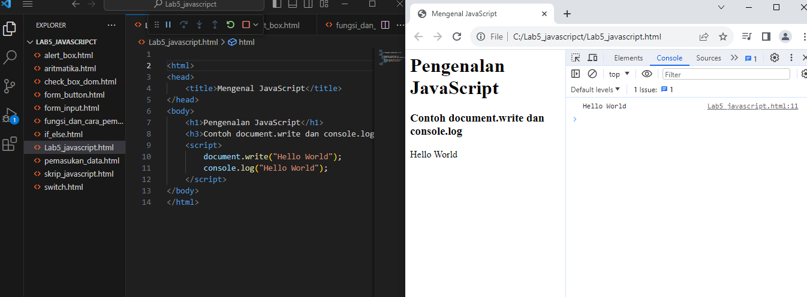

- Membuat javascript dasar alert box

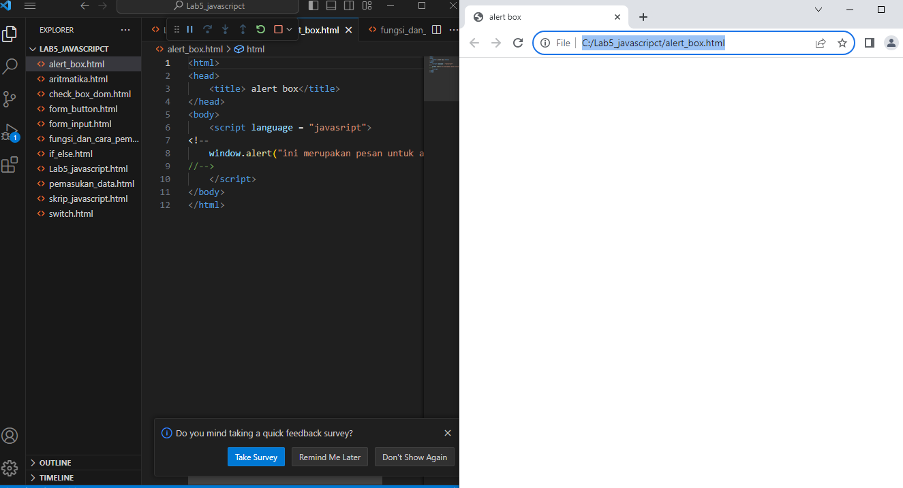

- method objek

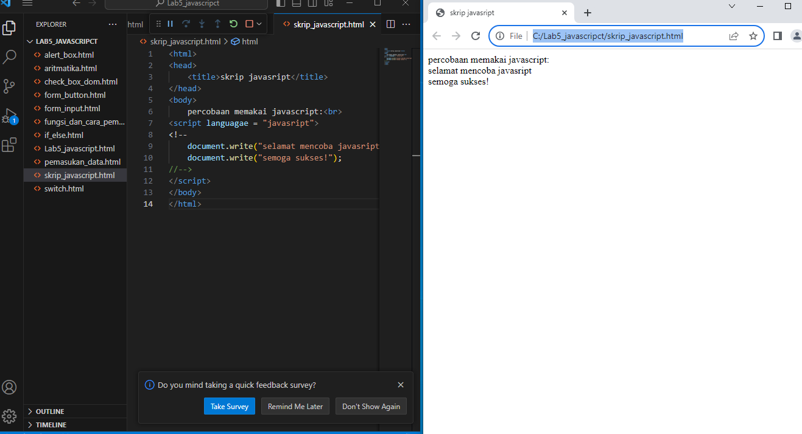

- Membuat pemakuan prompt nama

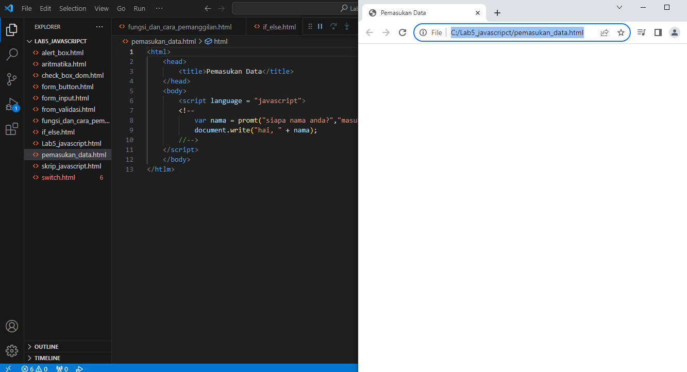

- fungsi javascript onload

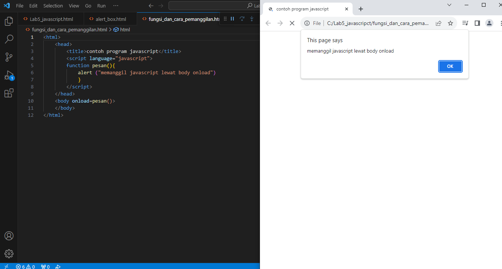

- Membuat operasi dasar aritmatika 

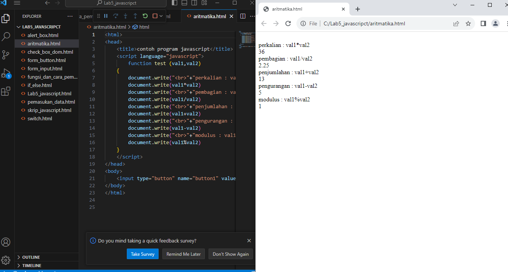

- Kemudian seleksi kondisi if_else

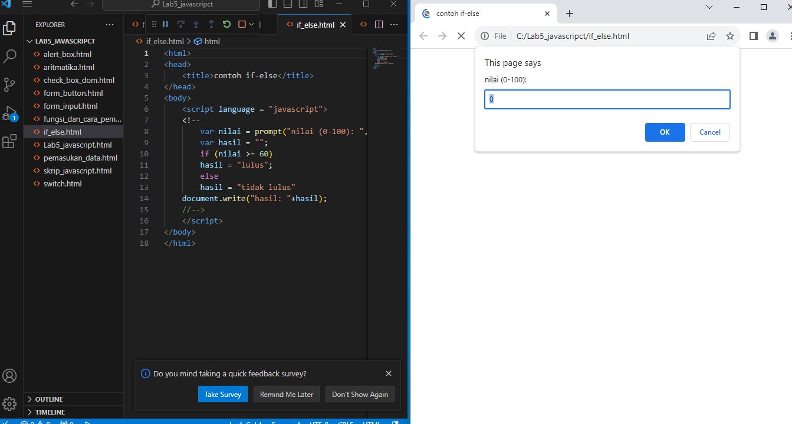

- Penggunaan operator switch

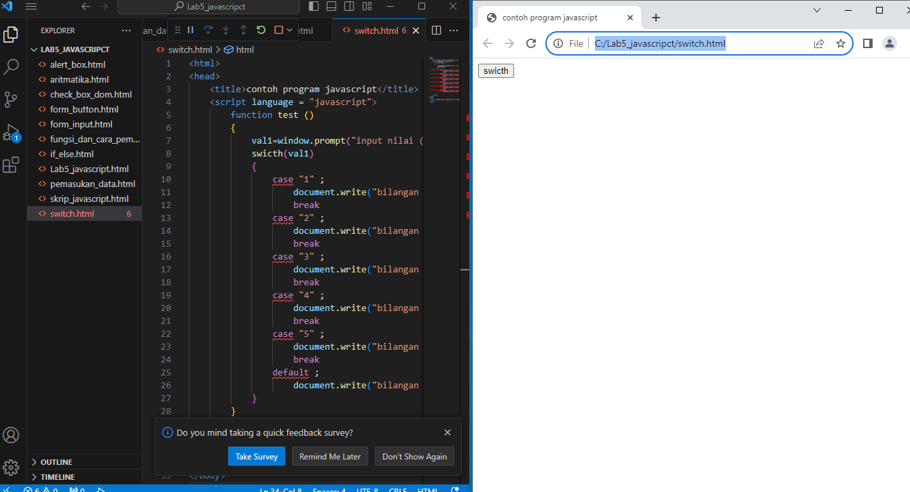

- Form Input 

- Form Button

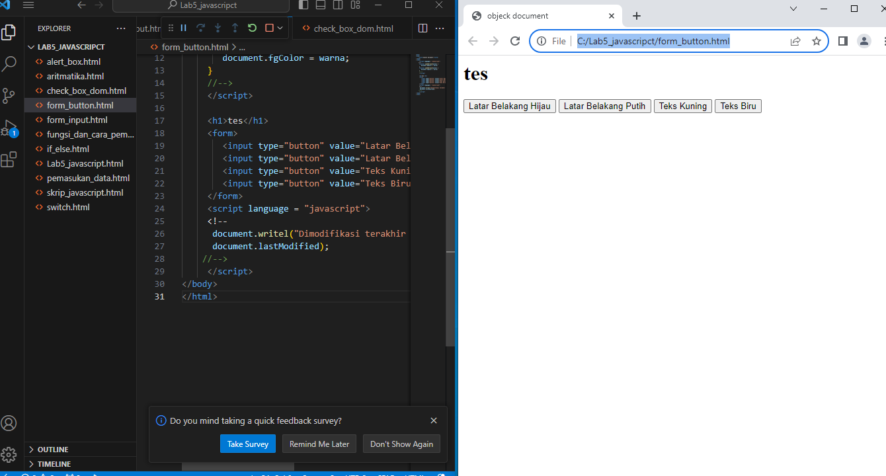

- HTML DOM

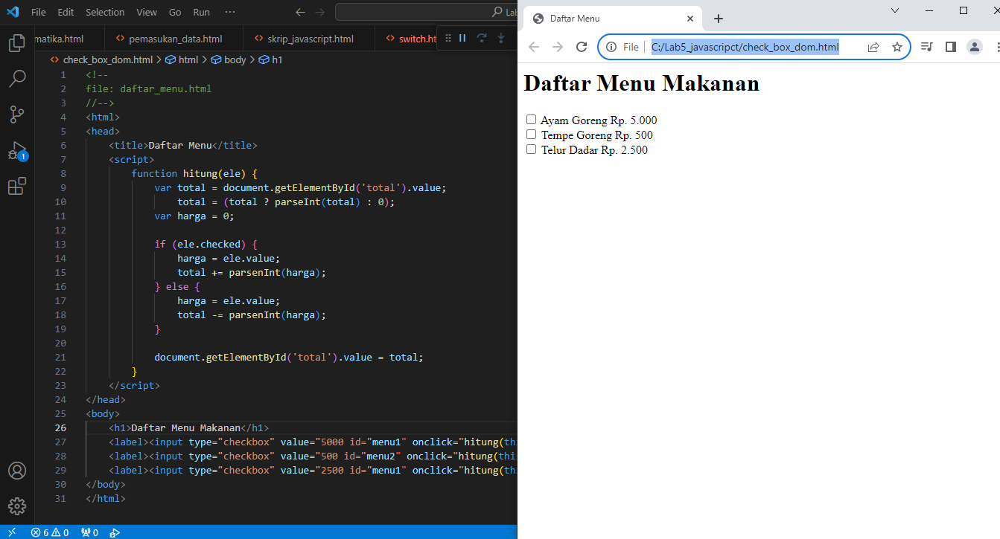

Pertanyaan dan Tugas

1. Buat script untuk melakukan validasi pada isiin form 

Jawaban Tugas

1. Pertama tama kita membuat seperti ini

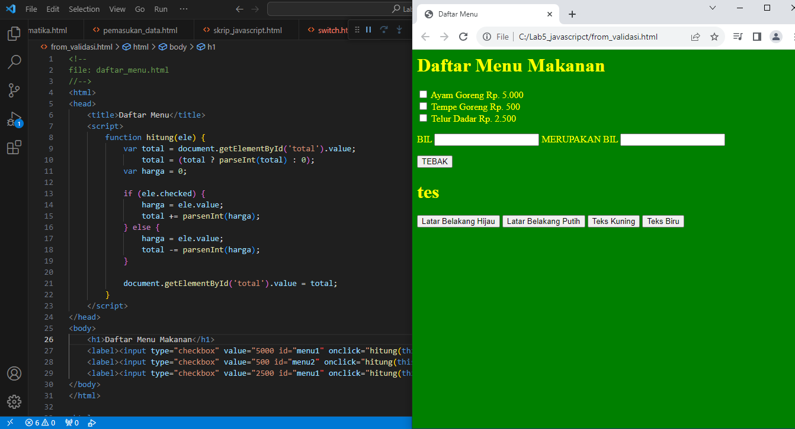

2. Kemudian kita melanjutkan seperti ini

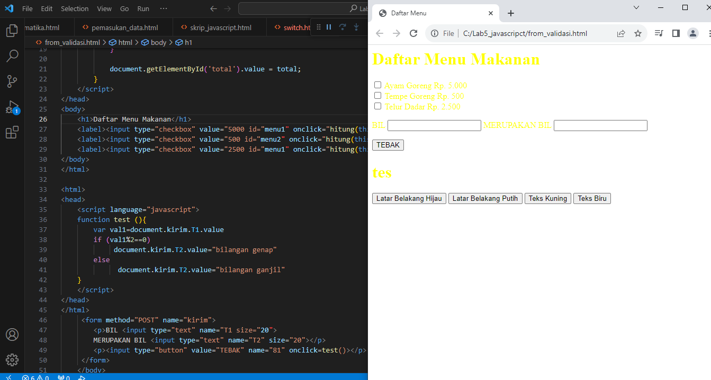

3. Kemudian kita membuat seperti ini

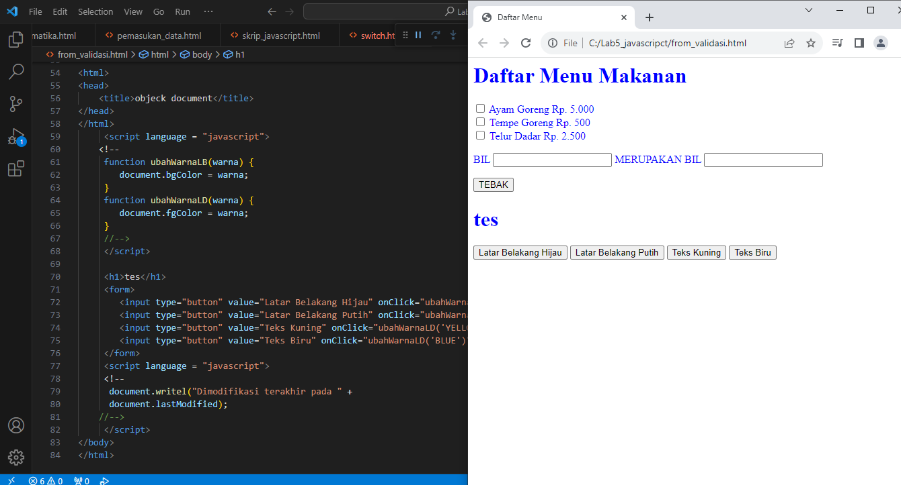

4. Opsi form
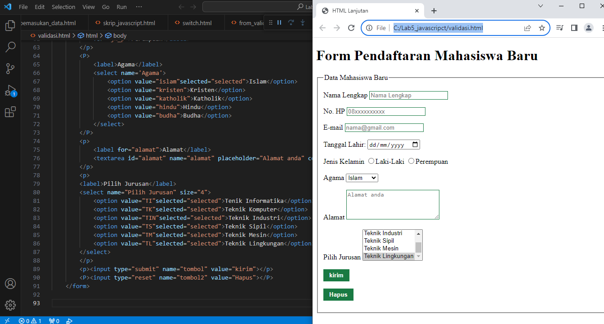
